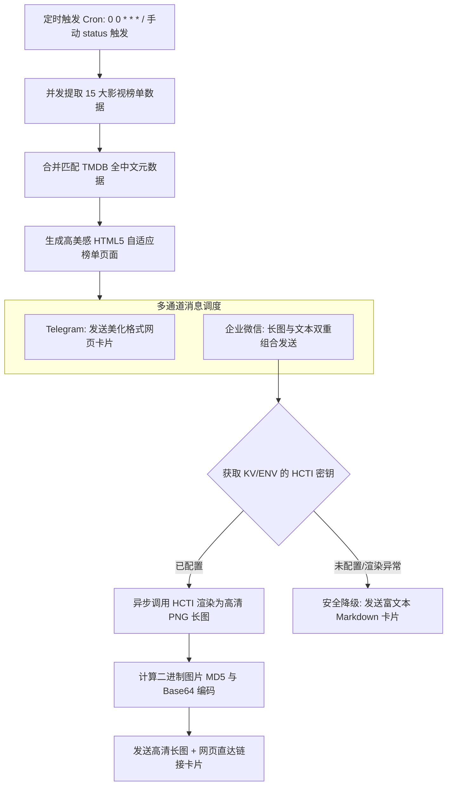

# 🎬 聚合影视推荐与多通道推送系统 (RMBD)

[](https://workers.cloudflare.com/)
[](https://www.typescriptlang.org/)
[](https://opensource.org/licenses/MIT)

> 基于 **Cloudflare Workers** 边缘计算构建的轻量级、无服务器（Serverless）影视榜单聚合推荐、可视化动态配置与智能推送系统。
> 
> 本系统运行于 Cloudflare 全球边缘节点，并发调用 **TMDB**、**豆瓣** 及 **猫眼** 官方与移动端私有 API，实时生成支持响应式设计的自适应 HTML5 影视卡片网页。系统配备了强大的**可视化管理后台 (`/admin`)** 与 **系统自检面板 (`/status`)**，支持 **Telegram** 与 **企业微信（WeCom）** 消息推送。通过对接 HCTI 引擎，系统可将榜单网页动态渲染为高清长图内嵌发送，为您带来极佳的跨平台阅读体验。

---

## ✨ 核心特性

### 1. 🌐 多源聚合影视中心
- 支持 TMDB、豆瓣、猫眼三大主流平台共 **15 个精选影视榜单**（覆盖流行电影、热映剧集、口碑综艺、合集、实时票房等）。
- 所有榜单网页均为高度定制的自适应响应式设计，完美适配手机、平板与桌面浏览器。

### 2. ⚙️ 动态可视化管理后台 (`/admin`)
- **零代码热更新**：摆脱了 Cloudflare Workers 沙箱环境中 `process.env` 只读且修改必须重新部署的局限性。用户可直接在 `/admin` 可视化网页中热配置各种 API 密钥及推送参数。
- **高级暗色毛玻璃美学 (Glassmorphism)**：界面采用精心调配的 HSL 渐变与 `backdrop-filter` 磨砂背景，配合灵动的微交互动画与实时表单校验，呈现极强的科技与现代感。
- **安全网关校验**：访问受 4 位数字安全 PIN 码保护，验证通过后发放安全 Session Cookie（有效期 30 天），防止未授权的恶意访问与配置篡改。

### 3. 💾 智能双轨存储方案 (KV + ENV)
- **KV 存储优先**：系统优先读取 Cloudflare **KV Namespace** 中的 `BOT_CONFIG` 参数。
- **环境变量回退**：若 KV 未初始化或对应键为空，系统自动无缝回退到 Workers 的系统环境变量（`env`），既支持全静态零配部署，也支持动态热配置。
- **输入容错过滤**：读取时自动裁剪输入参数首尾的空格及换行符，防范移动端复制粘贴夹带空格导致的配置失效。

### 4. 🎨 企业微信高清长图推送 (HCTI)
- **极速长图渲染**：集成 [HtmlCssToImage (HCTI)](https://htmlcsstoimage.com/) 引擎，将精美的响应式榜单网页一键渲染为高清 PNG 图片。
- **边缘签名算法**：在边缘节点异步计算二进制数据流的 **MD5 校验和** 与 **Base64 编码**，以原生图片消息格式完美内嵌发送至企业微信机器人，附带直达网页卡片。
- **无缝容错降级**：若未配置 HCTI 服务或接口调用失败，推送自动降级至 **Markdown 文本链接卡片模式**，确保机器人消息全天候不间断稳定送达。

### 5. ⚡ 边缘级缓存与防盗链优化
- **双重边缘缓存**：
  - **页面级缓存**：对 `/view/:id` 路由的最终渲染网页进行 1 小时边缘缓存，支持 `?nocache=true` 参数手动强制旁路刷新。
  - **API 级数据缓存**：对 TMDB / 豆瓣 / 猫眼接口抓取子请求启用最高 24 小时的边缘 TTL 缓存，提升渲染速度并规避上游频控。
- **海报防盗链破防与 CDN 代理**：
  - 自动将所有的协议相对链接补全，全量路由到基于 Cloudflare 节点的 `wsrv.nl` 图像 CDN 进行高速代理，彻底解决国内访问 TMDB 慢、以及豆瓣和猫眼防盗链 403 导致图片破损的问题。
- **豆瓣 WAF 稳定破防**：
  - 注入豆瓣官方 Frodo 移动端私有 `apikey` 认证，模拟 iOS Safari 真实移动设备 Headers 头信息，免遭豆瓣针对边缘节点的风控防火墙拦截。

---

## 🏗️ 系统架构图



---

## 📋 影视榜单路由对应表 (`/view/:id`)

系统目前集成以下 15 个精选榜单，每个榜单均支持独立的缓存控制与海报 CDN 优化：

| 榜单 ID | 榜单名称 | 数据源 | 类型 | 核心特点 |
| :--- | :--- | :--- | :--- | :--- |
| `tmdb_trending` | 🎬 TMDB 流行趋势 | TMDB | 混合 | 实时反映全球热门电影和剧集趋势 |
| `tmdb_movie_popular` | 🎥 TMDB 热门电影 | TMDB | 电影 | 全球最受关注的经典和新作电影 |
| `tmdb_movie_now_playing` | 🍿 TMDB 正在热映 | TMDB | 电影 | 当前全球院线上映中的高关注度影片 |
| `tmdb_tv_popular` | 📺 TMDB 热门剧集 | TMDB | 剧集 | 全球流行美剧、日韩剧等电视节目 |
| `douban_movie_hot` | 🔥 豆瓣热门电影 | 豆瓣 | 电影 | 国内影迷最关注的电影热榜 |
| `douban_movie_latest` | 🆕 豆瓣最新电影 | 豆瓣 | 电影 | 刚刚上线或上映的最新电影推荐 |
| `maoyan_movie_hot` | 🐱 猫眼热映电影 | 猫眼 | 电影 | 国内院线热映榜，含今日票房及总票房 |
| `douban_tv_hot` | 📡 豆瓣热门剧集 | 豆瓣 | 剧集 | 国内最受关注的热播中韩美陆剧等 |
| `douban_tv_latest` | ✨ 豆瓣最新剧集 | 豆瓣 | 剧集 | 最新开播、口碑发酵的剧集推荐 |
| `douban_tv_realtime_hot` | 📈 豆瓣实时热门剧集 | 豆瓣 | 剧集 | 实时热度最高的电视剧风向标 |
| `douban_tv_chinese_best` | 📺 豆瓣华语口碑剧集 | 豆瓣 | 剧集 | 高分国产/华语电视剧口碑排行榜 |
| `douban_tv_global_best` | 🌍 豆瓣全球口碑剧集 | 豆瓣 | 剧集 | 高分海外（美日韩英等）电视剧热榜 |
| `douban_show_chinese_best` | 🎤 豆瓣国内口碑综艺 | 豆瓣 | 综艺 | 最具话题度与高口碑的国内综艺栏目 |
| `douban_movie_weekly_best` | 🏅 豆瓣一周口碑电影 | 豆瓣 | 电影 | 豆瓣影迷本周评选出的高分佳作 |
| `douban_mixed_ecqm` | 🌟 豆瓣精选合集 | 豆瓣 | 混合 | 深度选取的优质合集榜单与小众佳作 |

---

## 🔑 动态变量配置说明

支持通过 **`/admin` 配置后台**、**Cloudflare 控制台** 或 **Wrangler Secret 命令行** 进行设定。

### 1. 核心与推送通道变量

| 变量名 | 说明 | 获取与获取路径 |
| :--- | :--- | :--- |
| `TMDB_API_KEY` | TMDB API 密钥 | 前往 [TMDB 控制中心](https://www.themoviedb.org/settings/api) 创建免费 API 密钥 |
| `TG_BOT_TOKEN` | Telegram 机器人 Token | 通过 [@BotFather](https://t.me/BotFather) 创建 Bot 后获得 |
| `TG_CHAT_ID` | Telegram 目标 Chat ID | 接受消息的频道用户名（如 `@my_channel`）或个人数字 Chat ID |
| `WECOM_WEBHOOK_URL`| 企业微信群机器人 Webhook | 在企微群组中右键添加“群机器人”，获取其 Webhook URL。为空则不推送企微。 |

### 2. 高清长图渲染服务（可选）

| 变量名 | 说明 | 获取与获取路径 |
| :--- | :--- | :--- |
| `HCTI_API_ID` | HtmlCssToImage API ID | 注册 [HtmlCssToImage](https://htmlcsstoimage.com/) 免费获得 |
| `HCTI_API_KEY` | HtmlCssToImage API Key | 注册 [HtmlCssToImage](https://htmlcsstoimage.com/) 免费获得 |

### 3. 系统口令安全保护

| 变量名 | 说明 | 初始默认值 |
| :--- | :--- | :--- |
| `PIN` | 系统诊断与管理后台安全验证码 | `4321` （可通过后台在 KV 中随时更换，无需重新编译部署） |

---

## 🚀 部署指南

### 前置条件
- 已安装 [Node.js](https://nodejs.org/) (v18.0.0 或更高版本)
- 已安装 `npm`
- 拥有免费或付费的 [Cloudflare](https://dash.cloudflare.com/) 账号

### 1. 克隆与安装依赖
```bash
git clone https://github.com/Hqsxjj/rmbd.git
cd rmbd
npm install
```

### 2. 绑定 Cloudflare KV Namespace (关键步骤)
为了启用强大的可视后台管理系统，您必须绑定一个名为 `BOT_CONFIG` 的 KV 命名空间：
1. 登录 [Cloudflare Dashboard](https://dash.cloudflare.com/)。
2. 导航至 **Workers & Pages** -> **KV** -> 点击 **Create Namespace**。
3. 命名空间名称输入：`rmbd_bot_config`。
4. 记下生成的命名空间 **ID**。
5. 打开项目根目录下的 **[wrangler.jsonc](file:///C:/Users/Administrator/.gemini/antigravity/scratch/rmbd_hqsxjj/wrangler.jsonc)**，修改其中的 `kv_namespaces` 配置：
   ```json
   "kv_namespaces": [
       {
           "binding": "BOT_CONFIG",
           "id": "您刚刚创建的命名空间ID"
       }
   ]
   ```

### 3. 初始化上传敏感密钥（可选）
如果您不想使用 Web 后台进行首次配置，也可直接使用命令行批量上传本地环境变量到边缘：
```bash
npx wrangler secret put TMDB_API_KEY
npx wrangler secret put TG_BOT_TOKEN
npx wrangler secret put TG_CHAT_ID
npx wrangler secret put WECOM_WEBHOOK_URL
npx wrangler secret put HCTI_API_ID
npx wrangler secret put HCTI_API_KEY
npx wrangler secret put PIN
```

### 4. 编译并部署至 Cloudflare Workers
```bash
npm run deploy
```
部署成功后，控制台将输出您的专属边缘服务 URL，例如：
`https://rmbd.your-username.workers.dev`

---

## ⚙️ 后台管理与诊断测试控制台

系统内置了两大可视管理工具，兼顾配置便捷度与系统透明度：

### 1. 🔒 `/admin` - 动态变量管理中心
- **访问路径**：`https://your-worker.workers.dev/admin`
- **功能**：输入安全口令进入，提供了美轮美奂的毛玻璃表单卡片。在此可输入、测试并动态保存所有的全局参数（如 TMDB KEY、群机器人地址等）。保存后自动通过 KV 同步全球边缘节点，即刻生效。

### 2. 📊 `/status` - 核心诊断与自检测面板
- **访问路径**：`https://your-worker.workers.dev/status`
- **功能**：
  - **环境诊断**：可视化呈现当前配置（安全打码），显示数据来源（KV 写入 或 静态 ENV）。
  - **上游网络延迟测试**：实时测试 Worker 到 TMDB 官方、豆瓣 API、猫眼 API 及图片 CDN (`wsrv.nl`) 的并发网络连通性与响应时间（ms）。
  - **测试推送按钮**：支持一键向 Telegram 或企业微信发送一条测试消息，排查通道配置是否正确。
  - **手动触发同步**：一键手动拉取 15 大榜单，并直接对所有绑定的通道投递高清榜单消息。

---

## ⏰ 定时推送配置

在 **[wrangler.jsonc](file:///C:/Users/Administrator/.gemini/antigravity/scratch/rmbd_hqsxjj/wrangler.jsonc)** 配置文件中，`triggers.crons` 定义了定时器规则：
```json
"triggers": {
    "crons": ["0 0 * * *"] // 每天北京时间 08:00 (UTC 00:00) 自动运行
}
```
如果您需要修改推送频率（例如改为每周一推送或每天多次推送），只需修改对应的标准 Cron 表达式并重新运行 `npm run deploy` 即可。

---

## 📄 开源协议

本项目基于 **MIT** 协议开源，鼓励自由克隆、二次开发与集成！
