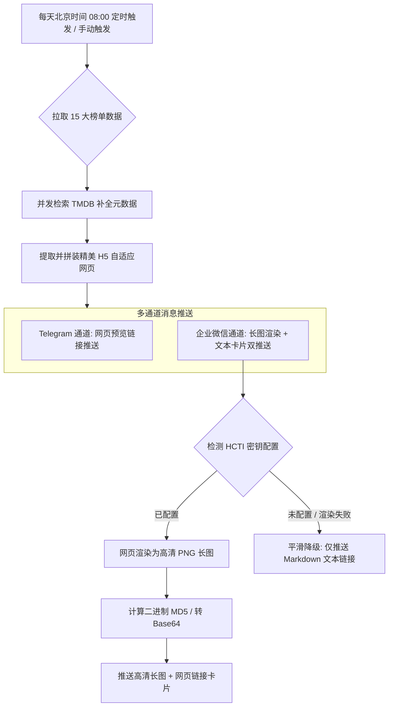

# 🎬 RMBD 聚合影视推荐与多通道推送系统

[](https://workers.cloudflare.com/)
[](https://www.typescriptlang.org/)
[](https://opensource.org/licenses/MIT)

> 基于 **Cloudflare Workers** 边缘计算构建的轻量级、无服务器（Serverless）影视榜单推荐与智能推送系统。
>
> 本系统在 Cloudflare 边缘节点直接并发调用 **TMDB**、**豆瓣** 及 **猫眼** API，实时生成美观且支持响应式设计的 HTML5 自适应网页。同时，系统支持 **Telegram** 与 **企业微信（WeCom）** 双通道消息推送，并能自动将榜单网页转换为高清长图直接发送，为您呈现极佳的移动端榜单阅读体验。

---

## ✨ 核心特性

- 🌐 **多源聚合，一网打尽**
  支持 TMDB、豆瓣、猫眼三大平台的 **15 个精选影视榜单**（覆盖流行电影、热播剧集、口碑综艺、合集、实时票房等）。
- 🎨 **企业微信高清长图推送 (HCTI)**
  集成 [HtmlCssToImage (HCTI)](https://htmlcsstoimage.com/) API，将精美排版的榜单网页一键渲染为高清 PNG 长图，由 Cloudflare 边缘节点动态计算 **二进制 MD5 校验和** 与 **Base64 编码** 后直接内嵌发送至企业微信机器人，并附带直达网页版入口。
- 🛡️ **100% 稳定降级与容错**
  极度健壮的架构设计，若未配置图片渲染密钥或 HCTI 服务调用失败，推送会自动平滑降级至 **Markdown 文本链接推送模式**，保证机器人全天候不间断稳定运行。
- ⚡ **边缘级多重缓存与性能优化**
  - **网页缓存**：对 `/view/:id` 路由的最终渲染网页利用 Cloudflare Workers `caches.default` 进行 1 小时边缘缓存，支持 `?nocache=true` 参数手动旁路刷新缓存。
  - **数据缓存**：对 TMDB / 豆瓣 / 猫眼 API 抓取及检索子请求启用 1 小时至 24 小时的边缘 TTL 缓存，极大加快渲染速度并规避上游频率限制。
- 🎯 **防盗链 & 访问破防优化**
  - **海报代理**：自动补全以 `//` 开头的协议相对链接，并全量使用基于 Cloudflare CDN 的 `wsrv.nl` 代理海报图片，彻底解决国内访问 TMDB 慢、以及豆瓣和猫眼海报防盗链 403 导致图片破损的问题。
  - **API 稳定认证**：豆瓣数据接口全面注入 Frodo 官方移动端私有密钥（`apikey`），并模拟 iOS Mobile Safari 高可信头部信息，彻底规避豆瓣对 Worker 节点的 WAF 风控拦截。
- 🇨🇳 **全面中文本土化**
  智能补全 TV 剧集季数，优先选用豆瓣/猫眼等国内源的中文演职员名称，并将 TMDB 发行国家、影片类型等元数据完整汉化。
- 🛠️ **控制台状态诊断与测试面板**
  内置 `/status` 现代化暗色系诊断面板，输入 PIN 码（默认 `4321`）即可实时自检环境变量、API 连通性，以及一键手动测试推送。

---

## 🏗️ 架构流程图



---

## 📋 榜单路由对应表 (`/view/:id`)

系统目前支持以下 15 个精选影视榜单，页面在移动端、平板及桌面端均具备极佳的响应式视觉表现：

| 榜单 ID | 榜单名称 | 数据源 | 类型 | 核心特点 |
| :--- | :--- | :--- | :--- | :--- |
| `tmdb_trending` | 🎬 TMDB 流行趋势 | TMDB | 混合 | 实时反映全球热门电影和剧集趋势 |
| `tmdb_movie_popular` | 🎥 TMDB 热门电影 | TMDB | 电影 | 全球最受关注的经典和新作电影 |
| `tmdb_movie_now_playing` | 🍿 TMDB 正在热映 | TMDB | 电影 | 当前全球院线上映中的高关注度影片 |
| `tmdb_tv_popular` | 📺 TMDB 热门剧集 | TMDB | 剧集 | 全球流行美剧、日韩剧等电视节目 |
| `douban_movie_hot` | 🔥 豆瓣热门电影 | 豆瓣 | 电影 | 国内影迷最关注的电影热榜 |
| `douban_movie_latest` | 🆕 豆瓣最新电影 | 豆瓣 | 电影 | 刚刚上线或上映的最新电影推荐 |
| `maoyan_movie_hot` | 🐱 猫眼热映电影 | 猫眼 | 电影 | 国内院线热映榜，含今日票房及总票房 |
| `douban_tv_hot` | 📡 豆瓣热门剧集 | 豆瓣 | 剧集 | 国内最受关注的热播中韩美陆剧等 |
| `douban_tv_latest` | ✨ 豆瓣最新剧集 | 豆瓣 | 剧集 | 最新开播、口碑发酵的剧集推荐 |
| `douban_tv_realtime_hot` | 📈 豆瓣实时热门剧集 | 豆瓣 | 剧集 | 实时热度最高的电视剧风向标 |
| `douban_tv_chinese_best` | 📺 豆瓣华语口碑剧集 | 豆瓣 | 剧集 | 高分国产/华语电视剧口碑排行榜 |
| `douban_tv_global_best` | 🌍 豆瓣全球口碑剧集 | 豆瓣 | 剧集 | 高分海外（美日韩英等）电视剧热榜 |
| `douban_show_chinese_best` | 🎤 豆瓣国内口碑综艺 | 豆瓣 | 综艺 | 最具话题度与高口碑的国内综艺栏目 |
| `douban_movie_weekly_best` | 🏅 豆瓣一周口碑电影 | 豆瓣 | 电影 | 豆瓣影迷本周评选出的高分佳作 |
| `douban_mixed_ecqm` | 🌟 豆瓣精选合集 | 豆瓣 | 混合 | 深度挖掘的豆瓣豆列及主题影视合集 |

---

## 🔑 环境变量与密钥配置

为了项目安全，请不要将密钥直接写在配置文件中。推荐使用 Cloudflare Dashboard 或 Wrangler 命令行管理。

### 1. 基础配置（数据源与 Telegram 通道）

| 变量名 | 说明 | 获取与配置方式 |
| :--- | :--- | :--- |
| `TMDB_API_KEY` | TMDB API 密钥 | 注册并前往 [TheMovieDB 账户设置](https://www.themoviedb.org/settings/api) 创建 API Key |
| `TG_BOT_TOKEN` | Telegram 机器人 Token | 通过 [@BotFather](https://t.me/BotFather) 创建 Bot 获取 Token |
| `TG_CHAT_ID` | Telegram 目标 Chat ID | 您的频道用户名（例如 `@my_channel`）或群组/个人数字 Chat ID |

### 2. 高级配置（企业微信与高清长图渲染）

| 变量名 | 说明 | 获取与配置方式 |
| :--- | :--- | :--- |
| `WECOM_WEBHOOK_URL`| 企业微信群机器人 Webhook | 在企业微信群中添加机器人，复制其 Webhook 链接。留空则跳过企微通道推送。 |
| `HCTI_API_ID` | HtmlCssToImage API ID | 注册 [HtmlCssToImage](https://htmlcsstoimage.com/) 免费获取 |
| `HCTI_API_KEY` | HtmlCssToImage API Key | 注册 [HtmlCssToImage](https://htmlcsstoimage.com/) 免费获取 |

> [!TIP]
> **强烈推荐配置 HCTI！**
> 启用后，企业微信收到的推送将从普通的文字链接升级为**排版精美、视觉极其惊艳的高清长图**，能够直接在群内完整预览全部影视推荐，体验非常棒！

---

## 🚀 部署指南

### 前置要求
- 已安装 [Node.js](https://nodejs.org/) (v18.0.0+)
- 已安装 `npm`
- 拥有一个 [Cloudflare](https://dash.cloudflare.com/) 账号

### 1. 克隆项目与安装依赖
```bash
git clone https://github.com/Hqsxjj/rmbd.git
cd rmbd
npm install
```

### 2. 绑定敏感环境变量
在终端中运行以下命令，将您的机密信息直接上传到 Cloudflare 边缘端（Wrangler 会自动引导您登录）：
```bash
npx wrangler secret put TMDB_API_KEY
npx wrangler secret put TG_BOT_TOKEN
npx wrangler secret put TG_CHAT_ID

# 以下为选填的企业微信及图片渲染配置
npx wrangler secret put WECOM_WEBHOOK_URL
npx wrangler secret put HCTI_API_ID
npx wrangler secret put HCTI_API_KEY
```

### 3. 一键编译并部署到 Cloudflare
```bash
npm run deploy
```
部署成功后，控制台会输出您专属的 Cloudflare Worker URL，例如：
`https://rmbd.your-username.workers.dev`

---

## ⚙️ 管理面板与手动触发

系统内置了美观的现代化暗色系自检与手动触发面板：

- **自检路径**：`/status`（例如 `https://your-worker.workers.dev/status`）
- **默认验证 PIN**：`4321`（您可以在 `src/index.ts` 顶部的代码中进行自定义修改）
- **主要功能**：
  - 🚀 **一键触发推送**：立即并发拉取全部 15 个榜单，并将推送发送至 Telegram 与企业微信通道。
  - 📨 **单通道联通性测试**：单独向 Telegram 或企业微信发送一条测试消息，排查网络配置。
  - 🔄 **上游 API 连通性测试**：测试 Worker 节点到 TMDB、豆瓣、猫眼及 `wsrv.nl` 代理的实时网络延迟。

---

## ⏰ 定时推送机制

系统默认在**北京时间每天早上 08:00**（UTC 00:00）自动拉取最新榜单数据，并向配置好的消息通道发送推送。

如果您想修改定时推送的频率或具体时间，可以打开项目中的 `wrangler.jsonc` 配置文件，在 `triggers.crons` 字段中更改 Cron 表达式。

---

## 📄 开源协议

本项目基于 **MIT** 协议开源。鼓励各位开发者自由克隆、修改并融入自己的个性化项目！
